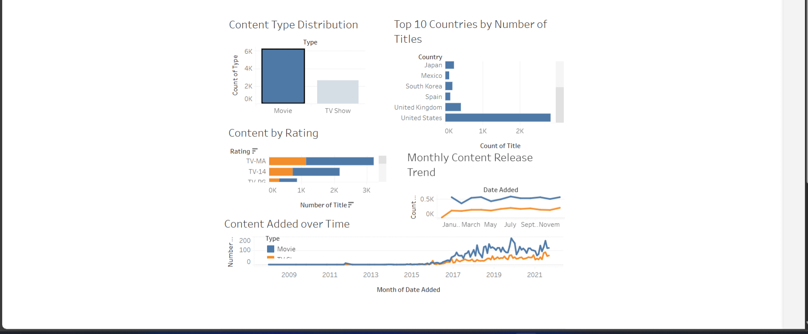

# 🧠 Netflix Analysis Dashboard
## 🎯 Project Overview

The Netflix Analysis Dashboard is an interactive data visualization project built using Tableau. It provides insights into Netflix’s content library, allowing users to explore trends, patterns, and distributions in the platform’s movies and TV shows dataset. The dashboard is designed to be intuitive, visually appealing, and easy to interact with.

## 💻 Dashboard Components
The dashboard is built on the netflix_titles.csv dataset and includes the following visualizations:

- Content Added over Time
Tracks the number of titles added monthly, showing trends for both movies and TV shows.

- Content Type Distribution
Displays the proportion of movies vs TV shows in the dataset.

- Content by Rating
Breaks down the number of titles by rating, highlighting the most common ratings.

- Top 10 Countries
Identifies and ranks the top 10 countries based on the number of titles produced.

## 🗂️ Data Source

Dataset: netflix_titles.csv

Connection: The dashboard uses a live connection to the CSV file in Tableau.

Attributes: Includes title, type, release year, rating, duration, country, and other details about Netflix content.

## 🖱️ How to Use the Dashboard
1. Download the files:
   - Netflix_Dashboard.twb
   - netflix_titles.csv
2. Install Tableau: Use Tableau Public or Tableau Desktop.
3. Open the dashboard: Open the Netflix_Dashboard.twb file in Tableau.
4. Explore the data: Interact with charts to filter, sort, and analyze Netflix content trends.

## 💡 Key Insights
- Movies dominate the content added in recent years.
- The United States produces the highest number of titles.
- Certain ratings are more common, reflecting Netflix’s content strategy.

## 🖼️ Screenshot

## 🛠️ Technologies Used
- Tableau Desktop / Tableau Public
- CSV dataset for content information

## 📝 License
This project is open source and available under the MIT License.
